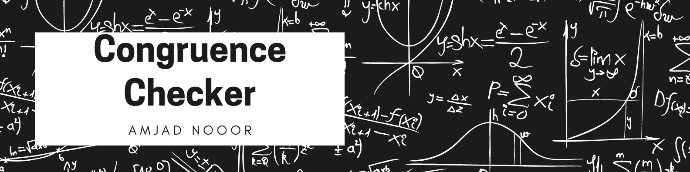

## What is congruence❓
> In geometry, two figures or objects are congruent if they have the same shape and size, or if one has the same shape and size as the mirror image of the other. ... This means that either object can be repositioned and reflected (but not resized) so as to coincide precisely with the other object.

###  What we do✨
> CONGRUENCE-CHECEKER helps user to check whether triangles are congruent or not.

### Flow
> User enters sides, angle of two triangles and 

### Screenshot📷

